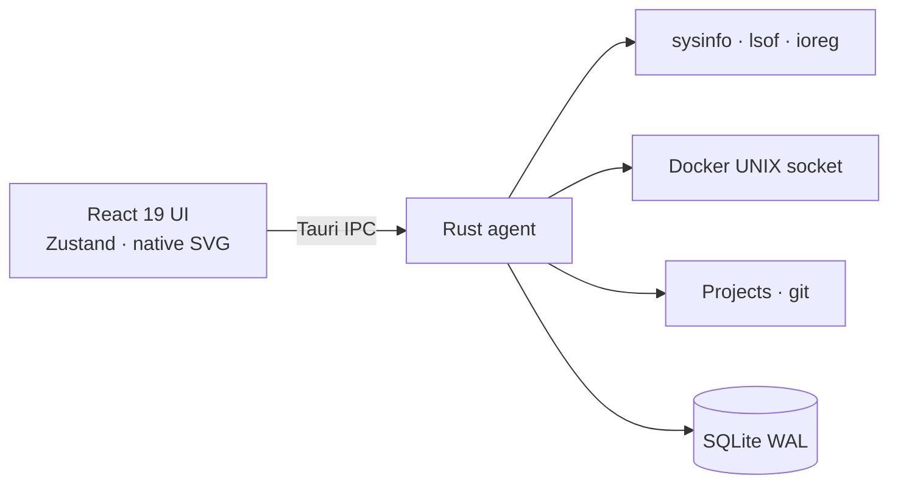

<p align="center">
  
</p>

<h1 align="center">FNode</h1>

<p align="center"><strong>Your machine. Your node. One pulse.</strong></p>
<p align="center">By Nitin Kanish</p>

<p align="center">
  Local-first macOS command center for developers.<br />
  See what is running, listening, and using this Mac — then stop it from here.
</p>

<p align="center">
  <a href="https://github.com/nitinkanish/fnode/raw/main/public/FNode.dmg"></a>
  
  
  
  
</p>

<p align="center">
  <a href="#download">Download</a> ·
  <a href="#whats-new-in-030">What’s new</a> ·
  <a href="#features">Features</a> ·
  <a href="#quick-start">Build</a> ·
  <a href="#privacy">Privacy</a>
</p>

FNode is a native desktop app (Tauri 2 + Rust + React). One 20-second snapshot covers CPU, memory, disks, **battery**, ports, processes, git projects, Docker, Homebrew, and local AI runtimes. Nothing leaves this Mac unless you opt into the cloud assistant or cost tracker.

---

## Download

**[FNode 0.3.0 for macOS (Apple Silicon)](https://github.com/nitinkanish/fnode/raw/main/public/FNode.dmg)** — [`public/FNode.dmg`](public/FNode.dmg) (~2.8MB)

Ad-hoc signed local build. Not Apple-notarized. macOS 12 or later.

1. Open the disk image and drag **FNode** into Applications.
2. First launch: **right-click FNode → Open → Open**.
3. If Gatekeeper still blocks it: **System Settings → Privacy & Security → Open Anyway**, or:

```bash
xattr -cr /Applications/FNode.app && open /Applications/FNode.app
```

Intel Macs: build from source on that machine (`pnpm tauri build`). A Gatekeeper-clean download needs Developer ID + notarization — see [Notarized release](#notarized-release-no-gatekeeper-warning).

---

## What’s new in 0.3.0

Native macOS chrome and a tighter local-first agent.

| | |
| --- | --- |
| **Menu bar** | Apple HIG FNode / File / Edit / View / Go / Window / Help. Close hides to the tray. |
| **Battery** | Charge, cycle count, max capacity vs design (ioreg). Condition Normal / Fair / Poor. |
| **Privacy sensors** | Camera and microphone watch via local `lsof`. FNode never opens either device. |
| **History** | 7- and 30-day CPU / RAM / disk / network, drawn with native SVG charts. |
| **Git** | Dirty / ahead / behind on discovered project folders (`/usr/bin/git` only). |
| **Costs** | Optional LLM/API spend from Cursor logs + OpenAI org costs. **Off by default.** |
| **Automations** | SQLite rules (CPU / RAM / idle server). Notify or **offer** to stop — never auto-kill. |
| **Databases** | One-click loopback connect for Postgres, Redis, and Mongo from the Ports page. |
| **About** | In-app About tab (version, bundle ID, data folder, privacy). Help → FNode Help. |
| **Size** | Release binary ~4.3MB. Shareable DMG ~2.8MB. |

---

## Screenshots

<table>
  <tr>
    <td width="50%">
      
      <p align="center"><sub>Overview — health, history, battery, hottest software</sub></p>
    </td>
    <td width="50%">
      
      <p align="center"><sub>Apps — GUI apps and localhost servers you can quit</sub></p>
    </td>
  </tr>
  <tr>
    <td width="50%">
      
      <p align="center"><sub>Ports — listeners, project path, DB quick-connect</sub></p>
    </td>
    <td width="50%">
      
      <p align="center"><sub>Settings — folders, privacy, costs, automations, About</sub></p>
    </td>
  </tr>
</table>

---

## Features

Built for how developers actually work on a Mac — not a generic activity monitor.

### Monitor

| Area | What you get |
| --- | --- |
| Overview | Health score, per-core CPU, RAM, swap, disk, temperature, load, network, hottest software, camera/mic, battery, 7/30-day history, optional API spend |
| Apps | Running `.app` bundles with icons · localhost servers (Next.js, Vite, Python, …) · Quit / Stop |
| Ports | `lsof` TCP `LISTEN` · process + project path · open in browser · Postgres / Redis / Mongo connect |
| Processes | Every process · macOS icons · stack detection · stop / restart with confirm |

### Workspace

| Area | What you get |
| --- | --- |
| Projects | Scan `~/Projects`, `~/Developer`, `~/Code`, `~/Documents`, `~/Desktop` · framework + language · git dirty / ahead / behind · Finder, Terminal, Cursor |
| Docker | Engine API over the local UNIX socket · start / stop / restart / logs / shell |
| AI models | Ollama, LM Studio, and similar · loaded models, family, size, quantization |
| Homebrew | `brew outdated --json=v2` · confirmed, allowlisted `brew upgrade` |

### Maintenance

| Area | What you get |
| --- | --- |
| Cache | Scan and empty known caches under `$HOME` with a live syscall log (`stat`, `readdir`, `unlink`) |
| Automations | SQLite rules · notify or offer to stop · **never auto-kill** |
| Assistant | Answers from the current machine snapshot · cloud is opt-in |
| Settings | Data paths, snapshot interval, privacy sensors, cost keys, About |

**Fail-closed process control.** Home-directory paths only, loopback URLs only, no restart of system binaries, no interpolation of untrusted strings. Destructive actions always confirm.

Data lives in `~/Library/Application Support/com.nitinkanish.fnode/`.

---

## Quick start

### Prerequisites

- macOS 12 or later (Apple Silicon or Intel)
- [Node.js](https://nodejs.org/) 20+
- [pnpm](https://pnpm.io/) 10+
- [Rust](https://rustup.rs/) stable
- Xcode Command Line Tools (`xcode-select --install`)

Optional: Docker Desktop, Ollama / LM Studio, Cursor, Homebrew.

### Run from source

```bash
git clone https://github.com/nitinkanish/fnode.git
cd fnode
pnpm install
pnpm tauri dev
```

Vite serves the UI at `http://localhost:1420`. Tauri opens the native window.

### Production build

```bash
pnpm tauri build
```

The `.app` lands in `src-tauri/target/release/bundle/macos/`. For a shareable ad-hoc DMG:

```bash
pnpm run build:macos:local
```

That writes [`public/FNode.dmg`](public/FNode.dmg) plus `How to open.txt` on the disk image.

### Notarized release (no Gatekeeper warning)

A GitHub/browser download stays blocked until Apple notarizes a **Developer ID Application** signature. `Apple Development` and ad-hoc (`signingIdentity: "-"`) cannot be notarized.

**If you are not on the signing team:** ship `pnpm run build:macos:local` and tell recipients to right-click → Open, or build from source. Do not commit secrets or `.p8` keys.

**If you hold Developer ID for team YLKU69SJ9T (DEBUGGED PRO PRIVATE LIMITED):**

1. Create **Developer ID Application** at [Certificates](https://developer.apple.com/account/resources/certificates/add) and install the `.cer` + private key on the build Mac.
2. App Store Connect → Users and Access → Integrations → **Team API key** (or an Apple ID [app-specific password](https://appleid.apple.com)).
3. From a clean tree:

```bash
export APPLE_SIGNING_IDENTITY="Developer ID Application: DEBUGGED PRO PRIVATE LIMITED (YLKU69SJ9T)"
export APPLE_TEAM_ID=YLKU69SJ9T
export APPLE_API_KEY=KEY_ID
export APPLE_API_ISSUER=ISSUER_UUID
export APPLE_API_KEY_PATH=/path/to/AuthKey_KEY_ID.p8
pnpm run build:macos:notarized
```

`scripts/build-macos-release.sh` signs, waits for notary, staples, and copies `public/FNode.dmg`. Confirm with `xcrun stapler validate public/FNode.dmg` and `spctl --assess --type open -vv public/FNode.dmg`.

---

## Architecture



| Path | Role |
| --- | --- |
| `src/` | Desktop UI — system light/dark, SF Pro, native controls |
| `src-tauri/src/` | System agent: live cache, scanners, process control, SQLite |
| `src-tauri/icons/` | macOS icon set |
| `public/` | Logo, installer DMG, README screenshots |
| `assets/` | Source icon artwork |

One snapshot every **20 seconds** (configurable, minimum 10s). SQLite writes on a slower cadence so `lsof` and `sysinfo` are not hammered. Open logs still follow in near real time.

### Tech stack

- **Desktop:** [Tauri 2](https://tauri.app/) · native NSMenu
- **Agent:** Rust (`sysinfo`, `rusqlite`, `bollard`, `reqwest`)
- **UI:** React 19, TypeScript, Tailwind CSS 4, Zustand
- **Package manager:** pnpm

---

## Privacy

- Scans run on-device
- Cloud assistant and cost tracking are **off** until you opt in
- API keys stay in local SQLite and are never echoed back to the UI
- Secret-looking environment variables are stripped from the renderer
- Camera / mic watch is `lsof` only — FNode never opens those devices
- Destructive actions require confirmation
- Cache delete never touches `/System`, `/usr`, or `/var`
- See [SECURITY.md](SECURITY.md) for the trust model and how to report issues

---

## Troubleshooting

**First Rust compile is slow**  
`rusqlite` builds bundled SQLite. Later runs are incremental.

**Docker page is empty**  
Start Docker Desktop. FNode uses the default local engine socket.

**Port list is empty**  
`/usr/sbin/lsof` must exist. Only TCP sockets in `LISTEN` are shown.

**CPU reads 0% at launch**  
Usage needs two samples. The next snapshot (default 20s) fills it in.

**Battery shows Unknown**  
Needs a successful `ioreg -n AppleSmartBattery`. Desktops without an internal battery show “not present.”

**macOS blocked the app**  
Right-click FNode → **Open**. Notarization is not included in the local DMG.

**Dock icon looks stale after a rename**  
Quit the previous `pnpm tauri dev` process fully, then start it again. macOS caches icons per binary name.

---

## Contributing

See [CONTRIBUTING.md](CONTRIBUTING.md). Issues and pull requests are welcome.

## Author

Created by **Nitin Kanish**.

## License

[MIT](LICENSE) © Nitin Kanish

---

<p align="center"><em>Your machine. Your node. One pulse.</em></p>
