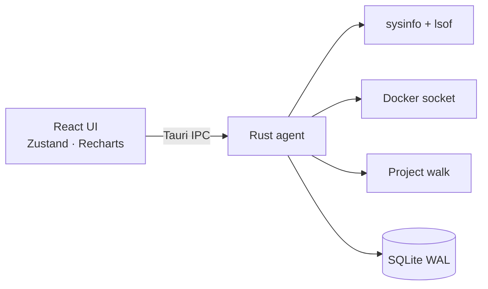

<p align="center">
  
</p>

<h1 align="center">FNode</h1>

<p align="center"><strong>Your machine. Your node. One pulse.</strong></p>
<p align="center">By Nitin Kanish</p>

<p align="center">
  A local-first macOS command center for developers.<br />
  See what is running, what is listening, and what is using the machine — then act on it.
</p>

<p align="center">
  
  
  
  
  
</p>

FNode is a native desktop app (Tauri + Rust + React) that watches **CPU, memory, disks, ports, processes, project folders, Docker, and local AI runtimes** on this Mac. Nothing is uploaded unless you turn on the optional OpenAI assistant.

## Download

**[Download FNode for macOS (Apple Silicon)](https://github.com/nitinkanish/fnode/raw/main/public/FNode.dmg)**

The installer is `public/FNode.dmg` in this repo (v0.1.0, Apple Silicon). macOS 12 or later.

After opening the disk image, drag **FNode** into Applications. The first launch of an unsigned build: right-click the app → **Open**.

Intel Macs: build from source with `pnpm tauri build` on that machine.

---

## Why FNode

Most “activity monitors” show everything. FNode is built for **how developers actually work**:

- One live dashboard with load average, per-core CPU, swap, network, and charts
- Listening ports joined to the process and the project that owns them
- Developer-oriented process view (Node, Python, Java, Go, Rust, common frameworks)
- Project discovery under `~/Projects`, `~/Developer`, `~/Code`, `~/Documents`, `~/Desktop`
- Open a project in **Finder**, **Terminal**, or **Cursor**
- Docker containers / images / volumes when Docker Desktop is running
- Detect Ollama, LM Studio, and other local model servers
- Stop or restart a process with confirmation — system processes stay protected
- Local assistant that answers from the current machine snapshot

**Local-first.** SQLite, settings, and restart logs stay in `~/Library/Application Support/com.fnode.app/`.

## Features

| Area | What you get |
| --- | --- |
| System | Live CPU, RAM, swap, disk, load 1/5/15, per-core bars, network in/out |
| Ports | `lsof` TCP `LISTEN` table with process, project path, and localhost open |
| Processes | Classified dev workloads, cwd/exe, stop / restart, Cursor / Finder / Terminal |
| Projects | Framework + language detection, git branch, folder details, open in Cursor |
| Docker | Engine API over the local UNIX socket |
| AI | Local provider detection; optional OpenAI in Settings (key never returned to the UI) |
| Assistant | Snapshot Q&A with no cloud unless you opt in |

## Screenshots

The coral fox-N mark is the app icon (sidebar, Dock, and Settings). Run `pnpm tauri dev` to explore the dashboard, charts, and project folder actions.

<p align="center">
  
</p>

## Quick start

### Prerequisites

- macOS 12 or later (Apple Silicon or Intel)
- [Node.js](https://nodejs.org/) 20+
- [pnpm](https://pnpm.io/) 10+
- [Rust](https://rustup.rs/) stable
- Xcode Command Line Tools (`xcode-select --install`)

Optional: Docker Desktop, Ollama / LM Studio, Cursor.

### Run from source

```bash
git clone https://github.com/nitinkanish/fnode.git
cd fnode
pnpm install
pnpm tauri dev
```

Vite serves the UI at `http://localhost:1420`. Tauri opens the native window.

### Production build

```bash
pnpm tauri build
```

The `.app` bundle is written to `src-tauri/target/release/bundle/macos/`. The `.dmg` is written to `src-tauri/target/release/bundle/dmg/` — copy it to `public/FNode.dmg` when you want the README download link to match a new release.

## Architecture



| Path | Role |
| --- | --- |
| `src/` | Desktop UI |
| `src-tauri/src/` | System agent: live cache, scanners, process control, SQLite |
| `src-tauri/icons/` | macOS / Windows icon set |
| `assets/` | Source icon artwork |

The UI polls **one** live snapshot (short TTL). SQLite is updated on a slower cadence so `lsof` and `sysinfo` are not hammered every tick.

Process control is fail-closed: home-directory paths only, loopback URLs only, no restart of system binaries, no AppleScript interpolation of untrusted strings.

## Tech stack

- **Desktop:** [Tauri 2](https://tauri.app/)
- **Agent:** Rust (`sysinfo`, `rusqlite`, `bollard`, `reqwest`)
- **UI:** React 19, TypeScript, Tailwind CSS 4, shadcn/ui, Zustand, Recharts
- **Package manager:** pnpm

## Privacy

- Scans run on-device
- OpenAI is **off** until you opt in; the key is stored only in local SQLite and is never sent back to the renderer
- Secret-looking environment variables are stripped from the UI
- Destructive actions require confirmation
- See [SECURITY.md](SECURITY.md) for the trust model and how to report issues

## Troubleshooting

**First Rust compile is slow**  
`rusqlite` builds bundled SQLite. Later runs are incremental.

**Docker page is empty**  
Start Docker Desktop. FNode uses the default local engine socket.

**Port list is empty**  
`/usr/sbin/lsof` must exist. Only TCP sockets in `LISTEN` are shown.

**CPU reads 0% at launch**  
Usage needs two samples. The next poll (default 3s) fills it in.

**Dock icon looks stale after a rename**  
Quit the previous `pnpm tauri dev` process fully, then start it again. macOS caches icons per binary name.

## Contributing

See [CONTRIBUTING.md](CONTRIBUTING.md). Issues and pull requests are welcome.

## Author

Created by **Nitin Kanish**.

## License

[MIT](LICENSE) © Nitin Kanish

---

<p align="center"><em>Your machine. Your node. One pulse.</em></p>
