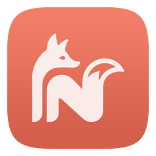
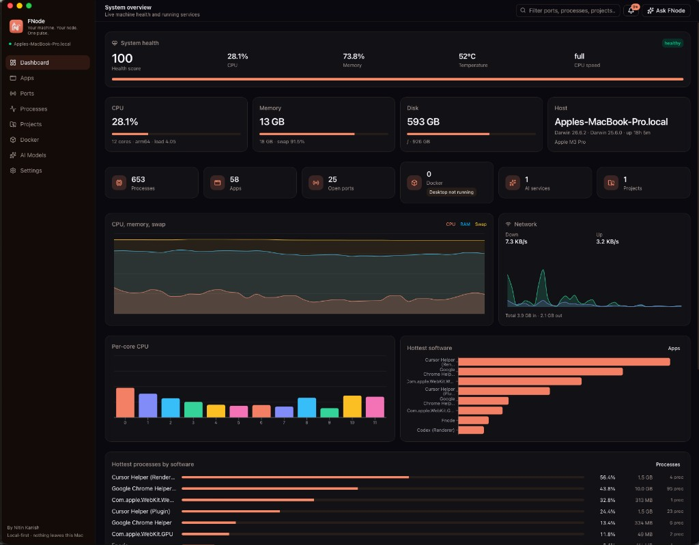
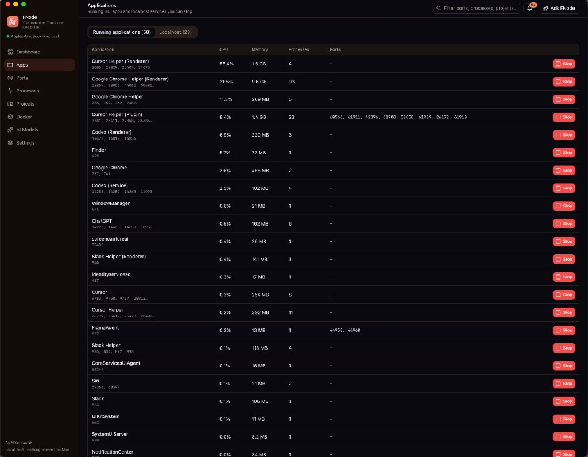
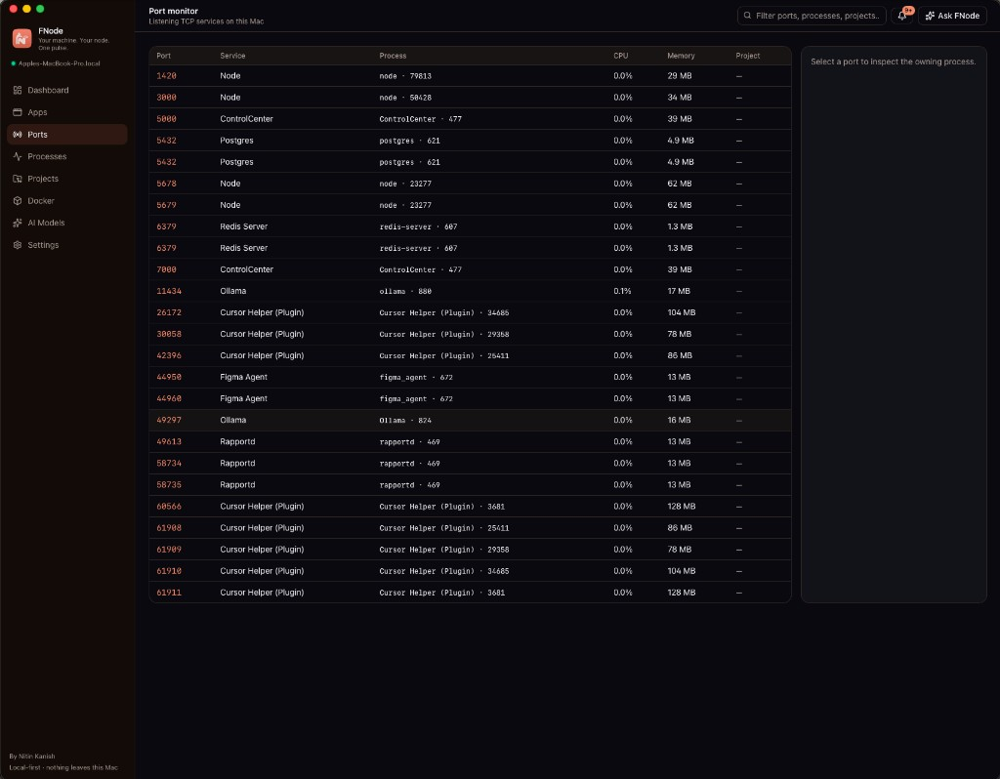
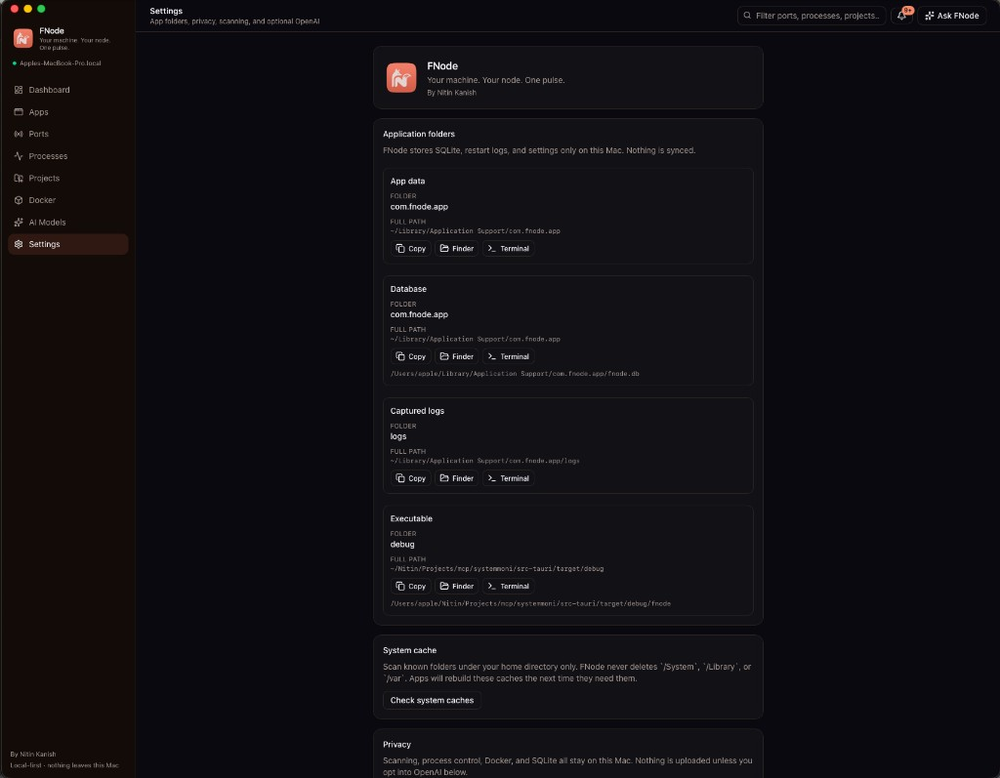
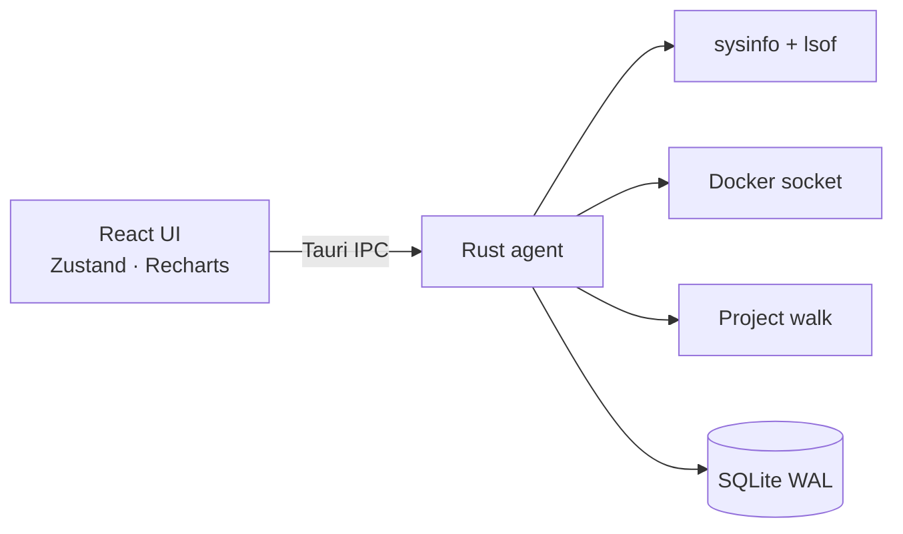

<p align="center">
  
</p>

<h1 align="center">FNode</h1>

<p align="center"><strong>Your machine. Your node. One pulse.</strong></p>
<p align="center">By Nitin Kanish</p>

<p align="center">
  A local-first macOS command center for developers.<br />
  See what is running, what is listening, and what is using the machine — then act on it.
</p>

<p align="center">
  <a href="https://github.com/nitinkanish/fnode/raw/main/public/FNode.dmg"></a>
  
  
  
  
</p>

FNode is a native desktop app (Tauri + Rust + React) that watches **CPU, memory, disks, ports, processes, project folders, Docker, and local AI runtimes** on this Mac. Nothing is uploaded unless you turn on the optional OpenAI assistant.

## Download

**[Download FNode 0.3.0 for macOS (Apple Silicon)](https://github.com/nitinkanish/fnode/raw/main/public/FNode.dmg)**

The installer lives in this repo at [`public/FNode.dmg`](public/FNode.dmg). macOS 12 or later. This is an **ad-hoc signed local build** — any Apple Silicon Mac can run it after the first-launch bypass below. It is not Apple-notarized.

1. Open the disk image.
2. Drag **FNode** into Applications.
3. First launch: **right-click FNode → Open → Open**. If macOS still blocks a browser download:
   - Open **System Settings → Privacy & Security**
   - Choose **Open Anyway**, then confirm **Open**
   - Or Terminal: `xattr -cr /Applications/FNode.app && open /Applications/FNode.app`

A Gatekeeper-clean download (no warning) needs a **Developer ID Application** certificate and Apple notarization. See **Notarized release** below.

Intel Macs: build from source with `pnpm tauri build` on that machine.

## Screenshots

<p align="center">
  
</p>
<p align="center"><em>Dashboard — health score, CPU / memory / disk, hottest software grouped by app.</em></p>

<p align="center">
  
</p>
<p align="center"><em>Apps — running Mac applications and localhost servers you can quit or stop.</em></p>

<p align="center">
  
</p>
<p align="center"><em>Ports — listening TCP services (Node, Postgres, Redis, Ollama, and more).</em></p>

<p align="center">
  
</p>
<p align="center"><em>Settings — local data folders, cache cleaner, privacy, optional OpenAI.</em></p>

## Why FNode

Most activity monitors show everything. FNode is built for **how developers actually work on a Mac**:

- Dashboard with health score, temperature, per-core CPU, swap, network, and hottest software
- **Apps** — GUI apps with icons, plus localhost servers (Next.js, Vite, Python, and similar) you can stop
- **Processes** — every process, with app icon, runtime, and framework
- Listening ports joined to the process and the project that owns them
- Project discovery under `~/Projects`, `~/Developer`, `~/Code`, `~/Documents`, `~/Desktop`
- Open a project in **Finder**, **Terminal**, or **Cursor**
- Docker containers / images / volumes when Docker Desktop is running
- Local AI: Ollama, LM Studio, and others — including which models are loaded in memory
- User-cache cleaner with a live log of OS calls (`stat`, `readdir`, `unlink`) — home directory only
- 20-second snapshot timer so FNode does not hammer the machine; logs you open still follow in near real time
- Stop or restart with confirmation — system processes stay protected
- Local assistant that answers from the current machine snapshot

**Local-first.** SQLite, settings, and restart logs stay in `~/Library/Application Support/com.nitinkanish.fnode/`.

## Features

| Area | What you get |
| --- | --- |
| Dashboard | Health score, CPU, RAM, swap, disk, temperature, load 1/5/15, per-core bars, network, hottest software |
| Apps | Running `.app` bundles with icons · localhost servers with framework/runtime · Quit / Stop |
| Ports | `lsof` TCP `LISTEN` table with process, project path, and localhost open |
| Processes | All processes · macOS icons · Next.js / Python / FastAPI / Vite and other stacks · stop / restart |
| Projects | Framework + language detection, git branch, folder details, open in Cursor |
| Docker | Engine API over the local UNIX socket |
| AI models | Ollama / LM Studio detection, loaded models, family / size / quantization |
| Cache | Scan and empty known caches under `$HOME` with a live syscall log |
| Assistant | Snapshot Q&A with no cloud unless you opt in |

## Quick start

### Prerequisites

- macOS 12 or later (Apple Silicon or Intel)
- [Node.js](https://nodejs.org/) 20+
- [pnpm](https://pnpm.io/) 10+
- [Rust](https://rustup.rs/) stable
- Xcode Command Line Tools (`xcode-select --install`)

Optional: Docker Desktop, Ollama / LM Studio, Cursor.

### Run from source

```bash
git clone https://github.com/nitinkanish/fnode.git
cd fnode
pnpm install
pnpm tauri dev
```

Vite serves the UI at `http://localhost:1420`. Tauri opens the native window.

### Production build

```bash
pnpm tauri build
```

The `.app` is written to `src-tauri/target/release/bundle/macos/`. For a shareable local DMG (ad-hoc signed, any Apple Silicon Mac):

```bash
pnpm run build:macos:local
```

That writes [`public/FNode.dmg`](public/FNode.dmg) plus a `How to open.txt` on the disk image. Recipients drag FNode to Applications, then right-click → Open.

### Notarized release (no Gatekeeper warning)

Needs team **YLKU69SJ9T** (DEBUGGED PRO PRIVATE LIMITED):

1. Account Holder or Admin creates a **Developer ID Application** certificate and installs it on the build Mac
2. App Store Connect API key, or Apple ID + [app-specific password](https://appleid.apple.com)
3. Run:

```bash
export APPLE_SIGNING_IDENTITY="Developer ID Application: DEBUGGED PRO PRIVATE LIMITED (YLKU69SJ9T)"
export APPLE_TEAM_ID=YLKU69SJ9T
# API key (preferred)
export APPLE_API_KEY=KEY_ID
export APPLE_API_ISSUER=ISSUER_UUID
export APPLE_API_KEY_PATH=/path/to/AuthKey_KEY_ID.p8
pnpm run build:macos:notarized
```

The script signs, notarizes, staples, and writes `public/FNode.dmg`. Apple Development certificates cannot be notarized.

## Architecture



| Path | Role |
| --- | --- |
| `src/` | Desktop UI |
| `src-tauri/src/` | System agent: live cache, scanners, process control, SQLite |
| `src-tauri/icons/` | macOS / Windows icon set |
| `public/` | Logo, installer DMG, README screenshots |
| `assets/` | Source icon artwork |

The UI takes **one snapshot every 20 seconds** (configurable, minimum 10s). SQLite is updated on a slower cadence so `lsof` and `sysinfo` are not hammered. Open logs still follow in near real time.

Process control is fail-closed: home-directory paths only, loopback URLs only, no restart of system binaries, no AppleScript interpolation of untrusted strings.

## Tech stack

- **Desktop:** [Tauri 2](https://tauri.app/)
- **Agent:** Rust (`sysinfo`, `rusqlite`, `bollard`, `reqwest`)
- **UI:** React 19, TypeScript, Tailwind CSS 4, shadcn/ui, Zustand, Recharts
- **Package manager:** pnpm

## Privacy

- Scans run on-device
- OpenAI is **off** until you opt in; the key is stored only in local SQLite and is never sent back to the renderer
- Secret-looking environment variables are stripped from the UI
- Destructive actions require confirmation
- Cache delete never touches `/System`, `/usr`, or `/var`
- See [SECURITY.md](SECURITY.md) for the trust model and how to report issues

## Troubleshooting

**First Rust compile is slow**  
`rusqlite` builds bundled SQLite. Later runs are incremental.

**Docker page is empty**  
Start Docker Desktop. FNode uses the default local engine socket.

**Port list is empty**  
`/usr/sbin/lsof` must exist. Only TCP sockets in `LISTEN` are shown.

**CPU reads 0% at launch**  
Usage needs two samples. The next snapshot (default 20s) fills it in.

**macOS blocked the app**  
Right-click FNode → **Open**. Notarization is not included in this distribution.

**Dock icon looks stale after a rename**  
Quit the previous `pnpm tauri dev` process fully, then start it again. macOS caches icons per binary name.

## Contributing

See [CONTRIBUTING.md](CONTRIBUTING.md). Issues and pull requests are welcome.

## Author

Created by **Nitin Kanish**.

## License

[MIT](LICENSE) © Nitin Kanish

---

<p align="center"><em>Your machine. Your node. One pulse.</em></p>
